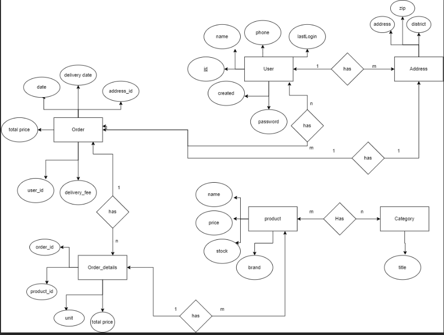
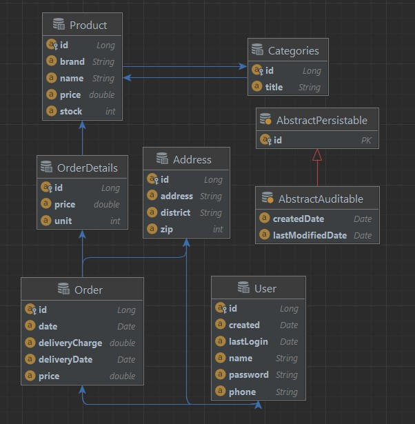

# springboot-ecommerce-backend.

Developing a monolithic eCommerce backend application that adheres to the standard principles of REST API would offer a well-structured and reliable way for clients.

N.B: My initial plan is to make a separate backend and a separate frontend with spring boot. Keeping this one as a standard will make other front-end applications.


## Planned ER Diagram for This project
 
## Schema after creating all the entity from ER Diagram
  


## product controller

#### Listing endpoint for product controller

<details>
 <summary><code>GET</code> <code><b>/product</b></code> <code>(gets all the product in json response)</code></summary>

##### Parameters

> None

##### Responses

| http code     | content-type                      | response    |
|---------------|-------------|---------------------------------------------------------------------|
 | `200`         | `text/plain;charset=UTF-8`        | JSON object |

##### Example cURL

> ```bash
>  curl -X GET -H "Content-Type: application/json" http://localhost:8080/
> ```

</details>


<details>
 <summary><code>GET</code> <code><b>/product/{id}</b></code> <code>(gets a single product and its detail in json response)</code></summary>

##### Parameters

| name | type     | data type   | description |
|------|----------|-------------|-------------|
| id   | required | JSON object | N/A         |
##### Responses

| http code     | content-type                      | response                          |
|---------------|-----------------------------------|-----------------------------------|
| `200`         | `text/plain;charset=UTF-8`        | JSON object                       |

##### Example cURL

> ```bash
>  curl -X GET -H "Content-Type: application/json" http://localhost:8080/
> ```

</details>


<details>
 <summary><code>POST</code> <code><b>/product</b></code> <code>(Creates Product)</code></summary>

##### Parameters

| name      |  type     | data type              | description                                                           |
|-----------|-----------|-------------------------|-----------------------------------------------------------------------|
| None      |  required | object (JSON)   | N/A  |


##### Responses

| http code     | content-type                      | response                                                            |
|---------------|-----------------------------------|---------------------------------------------------------------------|
 | `201`         | `text/plain;charset=UTF-8`        | `Configuration created successfully`                                |
 | `400`         | `application/json`                | `{"code":"400","message":"Bad Request"}`                            |
 | `405`         | `text/html;charset=utf-8`         | None                                                                |

##### Example cURL

> ```bash
>  curl -X POST -H "Content-Type: application/json" --data @post.json http://localhost:8080/
> ```

</details>


<details>
 <summary><code>PUT</code> <code><b>/product/{id}</b></code> <code>(Updates the product of given id )</code></summary>

##### Parameters

| name      |  type     | data type               | description |
|-----------|-----------|------|-----------------------------------------------------------------------|
| None      |  required | object (JSON )   | N/A  |


##### Responses

| http code     | content-type                      | response                                                            |
|---------------|-----------------------------------|---------------------------------------------------------------------|
| `201`         | `text/plain;charset=UTF-8`        | `Configuration created successfully`                                |
| `400`         | `application/json`                | `{"code":"400","message":"Bad Request"}`                            |
| `405`         | `text/html;charset=utf-8`         | None                                                                |

##### Example cURL

 ```bash
  curl -X POST -H "Content-Type: application/json" --data @post.json http://localhost:8080/
 ```

</details>


<details>
  <summary><code>DELETE</code> <code><b>/product/{id}</b></code> <code>(deletes products with the given id)</code></summary>

##### Parameters

| name              |  type     | data type      | description            |
|-------------------|-----------|------------------------|-------------------------------------|
| `id` |  required | int ($int64)   | The specific product id |


##### Responses

| http code     | content-type                      | response                                                      |
|---------------|---------------------------------------------------------------|---------------------------------------------------------------------|
| `200`         | `text/plain;charset=UTF-8`        | `product <name> was deleted succesfully deleted successfully` |

##### Example cURL

> ```bash
>  curl -X DELETE -H "Content-Type: application/json" http://localhost:8889/
> ```

</details>


## User controller

#### Listing endpoint for product controller

<details>
 <summary><code>GET</code> <code><b>/user</b></code> <code>(gets all the user in json response)</code></summary>

##### Parameters

> None

##### Responses

> | http code     | content-type                      | response    |
> |---------------|-------------|---------------------------------------------------------------------|
> | `200`         | `text/plain;charset=UTF-8`        | JSON object |

##### Example cURL

> ```javascript
>  curl -X GET -H "Content-Type: application/json" http://localhost:8080/
> ```

</details>


<details>
 <summary><code>GET</code> <code><b>/user/{id}</b></code> <code>(gets a single user and its detail in json response)</code></summary>

##### Parameters

> | name |  type     | data type               | description     |
>|------|-----------|-----------|--------------------|
> | id    |  required | JSON object  | N/A  |
##### Responses

> | http code     | content-type                      | response    |
> |---------------|-------------|---------------------------------------------------------------------|
> | `200`         | `text/plain;charset=UTF-8`        | JSON object |

##### Example cURL

> ```javascript
>  curl -X GET -H "Content-Type: application/json" http://localhost:8080/
> ```

</details>


<details>
 <summary><code>POST</code> <code><b>/user</b></code> <code>(Creates user)</code></summary>

##### Parameters

> | name      |  type     | data type              | description                                                           |
> |-----------|-----------|-------------------------|-----------------------------------------------------------------------|
> | None      |  required | object (JSON)   | N/A  |


##### Responses

> | http code     | content-type                      | response                                                            |
> |---------------|-----------------------------------|---------------------------------------------------------------------|
> | `201`         | `text/plain;charset=UTF-8`        | `Configuration created successfully`                                |
> | `400`         | `application/json`                | `{"code":"400","message":"Bad Request"}`                            |
> | `405`         | `text/html;charset=utf-8`         | None                                                                |

##### Example cURL

> ```javascript
>  curl -X POST -H "Content-Type: application/json" --data @post.json http://localhost:8080/
> ```

</details>


<details>
 <summary><code>PUT</code> <code><b>/user/{id}</b></code> <code>(Updates the user of given id )</code></summary>

##### Parameters

> | name      |  type     | data type               | description                                                           |
> |-----------|-----------|-------------------------|-----------------------------------------------------------------------|
> | None      |  required | object (JSON )   | N/A  |


##### Responses

> | http code     | content-type                      | response                                                            |
> |---------------|-----------------------------------|---------------------------------------------------------------------|
> | `201`         | `text/plain;charset=UTF-8`        | `Configuration created successfully`                                |
> | `400`         | `application/json`                | `{"code":"400","message":"Bad Request"}`                            |
> | `405`         | `text/html;charset=utf-8`         | None                                                                |

##### Example cURL

> ```javascript
>  curl -X POST -H "Content-Type: application/json" --data @post.json http://localhost:8080/
> ```

</details>


<details>
  <summary><code>DELETE</code> <code><b>/user/{id}</b></code> <code>(deletes user with the given id)</code></summary>

##### Parameters

> | name              |  type     | data type      | description            |
> |-------------------|-----------|------------------------|-------------------------------------|
> | `id` |  required | int ($int64)   | The specific product id |


##### Responses

> | http code     | content-type                      | response                                                      |
> |---------------|---------------------------------------------------------------|---------------------------------------------------------------------|
> | `200`         | `text/plain;charset=UTF-8`        | `user <name> was deleted succesfully deleted successfully` |

##### Example cURL

> ```javascript
>  curl -X DELETE -H "Content-Type: application/json" http://localhost:8889/
> ```

</details>


## user controller 
- [x] user create 
- [x] user update 
- [x] user delete
- [x] user read
- [ ] Logger Implementation

## product controller 
- [x] product create
- [x] product view(single product)
- [x] product delete 
- [x] product update 
- [x] product view with pagination
- [ ] Logger Implementation

## cart
- [ ] add to cart
- [ ] remove from cart
- [ ] view cart
- [ ] Logger Implementation
## Order  
- [ ] see order 
- [ ] place order
- [ ] update order
- [ ] update status
- [ ] Logger Implementation
